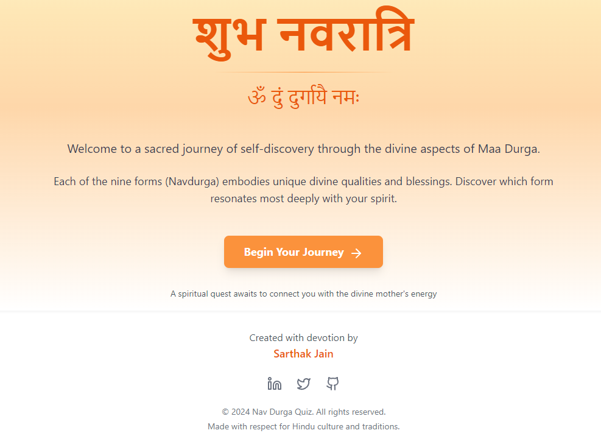
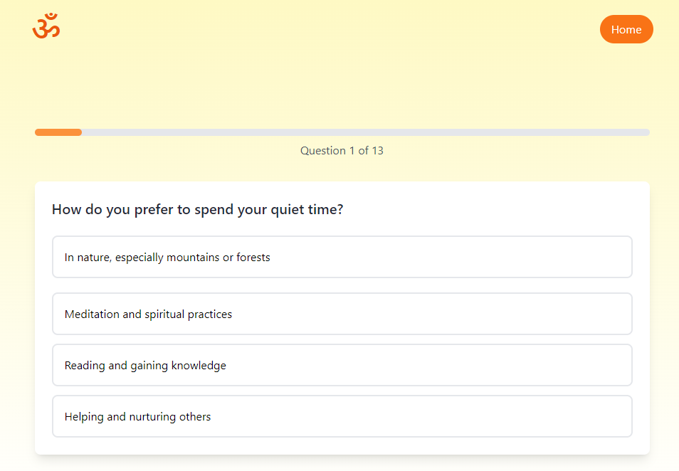
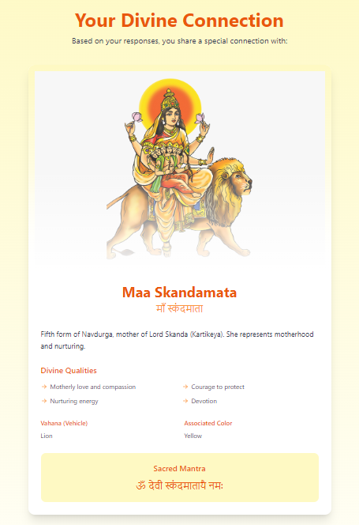
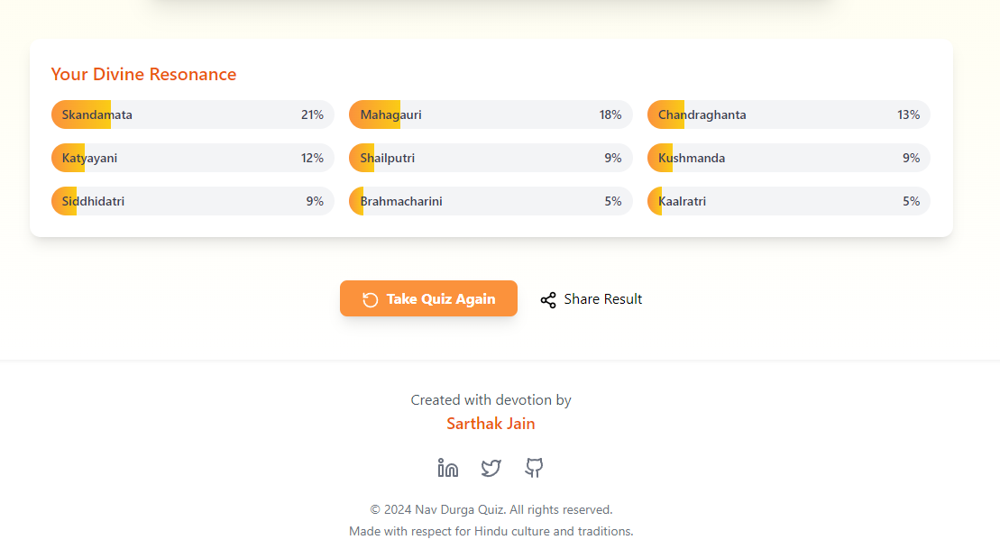

# Navratri Goddess Quiz 🌸🎨

**A fun and interactive quiz to discover which of the 9 Navratri goddesses you connect with, built with JavaScript, React, and Tailwind CSS.**

## Table of Contents

- [Project Overview](#project-overview)
- [Features](#features)
- [Tech Stack](#tech-stack)
- [How to Run Locally](#how-to-run-locally)
- [Future Enhancements](#future-enhancements)
- [Screenshots](#screenshots)
- [License](#license)

---

## Project Overview

This project allows users to answer a series of 13 questions, helping them discover which form of the 9 Navdurga goddesses (such as Shailputri, Brahmacharini, Chandraghanta, etc.) they resonate with the most. It's a unique blend of spirituality, fun, and culture presented through a beautiful web interface.

## Features

- **Interactive Quiz**: A 13-question quiz to determine which goddess the user connects with most.
- **Responsive Design**: Built with Tailwind CSS, ensuring a clean and responsive interface for mobile and desktop users.
- **Dynamic Results**: After completing the quiz, the user is matched with one of the 9 goddesses, with details on their personality and traits.
- **React Components**: Modular and reusable components for smooth user interaction.

## Tech Stack

- **JavaScript**: The core language for quiz logic.
- **React**: Frontend framework for building user interfaces.
- **Tailwind CSS**: Utility-first CSS framework for designing responsive layouts.
- **React Router**: For seamless navigation between quiz pages and the results.

## How to Run Locally

1. Clone the repository:

   ```bash
   git clone https://github.com/sarthak-wiz/nav-durga-quiz.git

2. Navigate into the project directory:

    ```bash
    cd nav-durga-quiz

3. Install dependencies:

    ```bash
    npm install

4. Start the development server:

    ```bash
    npm start

5. Open http://localhost:5173 in your browser to view the quiz.

## Future Enhancements

Add more detailed personality-related questions.
Implement user authentication to save quiz results.
Include subtle animations and transitions to improve user experience.
Expand on each goddess’s personality and traits with more detailed content.

## Screenshots









--- 

## License

This project is under the MIT License

---

# Happy Navratri! 🙏